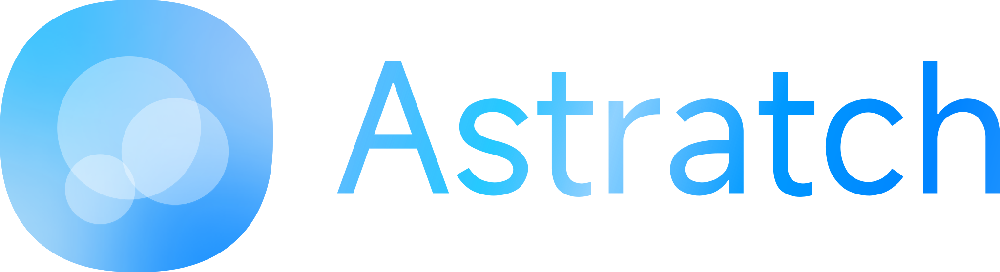

    <picture>
      <source media="(prefers-color-scheme: dark)" srcset="./src/assets/lightLogo.svg" alt="Astratch Light Logo">
      
    </picture> 
    
    
    
     
    <a href="./README.md" >English</a>
    

> _搭建起玩具和工具的桥梁。_

`Astratch` 是一个图形化IDE（集成开发环境），它希望可以让你以“搭积木”的方式搭出*任何东西*，就像Scratch一样。

# Astratch 做了什么？

简而言之，`Astratch`集百家之长，采用`JIT`（**即时编译**）技术来**编译**您的项目脚本为`JavaScript`并运行，这能让项目的运行速度*快如闪电*。同时，`Astratch`重新设计了**项目模型**，让项目变得更可维护、更为迅速，并增加了更多在**编程语言中常见的特性**。

`Astratch`依然使用与`Scratch`相同的编辑器——`Blockly`，并扩展加入了许多`Scratch`不曾有的功能，这使`Astratch`在`Scratch`的少儿语言和真正的游戏引擎/编程语言等搭建起了**缓冲桥**。

# 感谢

### Blockly

`Astratch` 克隆&修改&使用了 [blockly-examples](https://github.com/RaspberryPiFoundation/blockly-samples) 其中的部分插件：

- [Continuous Toolbox](./plugins/astratch-toolbox/)（改名为了 Astratch Toolbox）
- [field-angle](./plugins/field-angle/)
- [field-colour-hsv-sliders](./plugins/field-colour-hsv-sliders/)
- [field-colour](./plugins/field-colour/)
- [field-grid-dropdown](./plugins/field-grid-dropdown/)

我们对其中的插件进行了部分修改使其更加适配 `Astratch` 的*设想*，我们遵守`Apache License v2.0`，在每个更改的文件开头均有标注。

### ICONS

`Astratch` 使用了以下开源仓库的图标：

- [Material Symbols](https://github.com/google/material-design-icons)
- [Typicons](https://github.com/stephenhutchings/typicons.font)

再次表达我们的非常感谢！

# 开发

## 开源

`Astratch` 遵守 `Apache License v2.0`协议，简单来说，你可以**自由**地**使用、修改、复制**和**分发**`Astratch`（包括用于商业目的），但必须保留原始作者的版权声明（[NOTICE](./NOTICE)）和免责声明，并在修改的文件前加上**说明**确认你对此做了修改。

## 贡献

参见 [CONTRIBUTING-ZH-CN.md](./CONTRIBUTING-ZH-CN.md)
