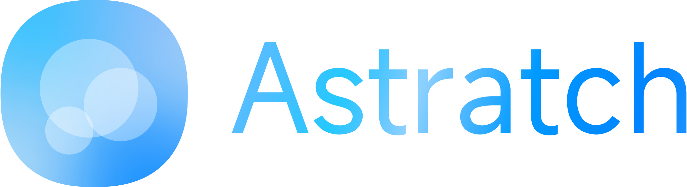
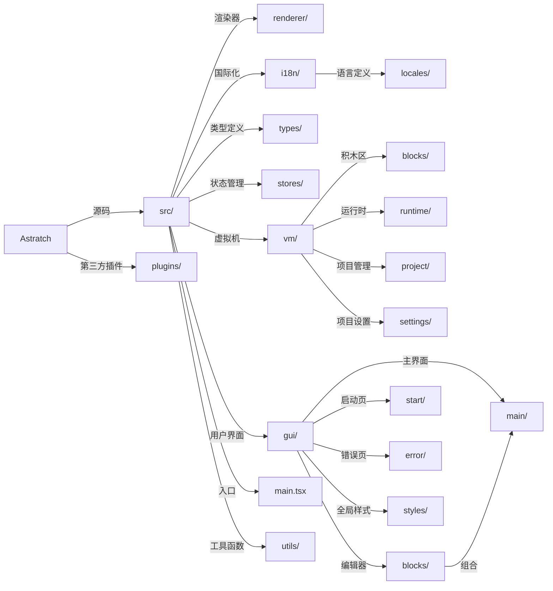

<div style="display: flex; flex-direction: column; gap: 20px; align-items: center; justify-content: center; width: 100%;">
  <div style="width: 250px; height: auto;">
    <picture>
      <source media="(prefers-color-scheme: dark)" srcset="./src/assets/lightLogo.svg" alt="Astratch Light Logo">
      
    </picture>
  </div>
</div>

> ### 也试试 [AstraEditor](https://github.com/AstraEditor) !

## 介绍

> 此项目的`我们`均指**AstrasTeam**，除非特有声明。

`Astratch` 是一个类似 `Scratch` 的开发平台，但它不基于任何 `Scratch` 改版。

值得一提的是，`Astratch` 可以兼容 `Scratch 3.0` 项目文件（`.sb3`），这意味着你可以在任何`Scratch`及其修改版平台上**无损运行**。

## 感谢

### Blockly

`Astratch` 克隆&修改&使用了 [blockly-example](https://github.com/RaspberryPiFoundation/blockly-samples) 其中的部分插件：

- [Continuous Toolbox](./plugins/continuous-toolbox/)
- [field-angle](./plugins/field-angle/)
- [field-colour-hsv-sliders](./plugins/field-colour-hsv-sliders/)
- [field-colour](./plugins/field-colour/)
- [field-grid-dropdown](./plugins/field-grid-dropdown/)

我们对其中的插件进行了部分修改使其更加适配 `Astratch` 的*设想*，我们遵守`Apache License v2.0`，在每个更改的文件开头均有标注。

### ICONS

`Astratch` 使用 **Google** 的 [Material Symbols](https://github.com/google/material-design-icons) 的开源图标

再次表达我们的非常感谢！

## 项目架构

`Astratch` 基于 `React` + `Vite` 技术栈。

`Astratch` 的项目结构如下:

> [!NOTE]
> 未来可能仍会变动。



### 国际化

`Astratch` 使用 `i18next`，您可以这样使用国际化：

```ts
import { t } from 'i18next';

t('id');
```

之后于`ASH\src\i18n\locales`配置语言

> 未来会支持线上添加新翻译

## 大饼

### Workspace

`Astratch` 暂会用最新的 `Blockly v13.0 `驱动工作区。在**未来**或将**重新**设计一个全新的`WebGPU`驱动的工作区，这个过程将会持续大约：

> # 很久很久

### 编译器

`Astratch` 会将积木编译为`WASM`或`JavaScript`，相比`TurboWarp`会有更加激进的优化和*更低的稳定性*。

### Todo

#### 现在

- [x] 基础项目目录、配置国际化
- [ ] 敲定项目文件格式
- [ ] 制作关于项目的 `API`
- [x] 制作基础积木编辑器
- [ ] 完善 `GUI`
- [ ] 制作 `VM` 、编译器（`ash` -> `JavaScript`/`WASM`）
- [ ] 完善积木编辑器

#### 未来

- [ ] `Electron` 桌面端
- [ ] `Tauri` 手机端+适配
