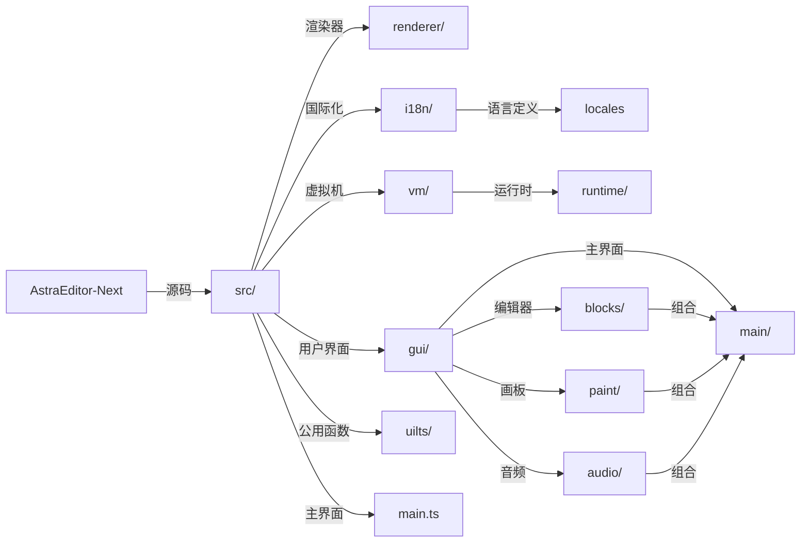

# AstraEditor-Next

> [!WARNING]
> 此项目仍为计划，具体动工时间未定。 

### [AstraEditor](https://github.com/AstraEditor)

## 介绍

`AstraEditor-Next` 是 `AstraEditor` 的 **重制版本**，它不再基于任何 `Scratch` 改版。

值得一提的是，`AstraEditor-Next` 可以兼容 `Scratch 3.0` 项目文件（`.sb3`），这意味着你可以在任何`Scratch`及其修改版平台上**无损运行**。

## 项目架构

`AstraEditor-Next` 基于 `React` + `Vite` 技术栈。

`AstraEditor-Next` 的项目结构如下:

> [!NOTE]
> 未来可能仍会变动。



### 国际化

`AstraEditor-next` 使用 `i18next`，并已将翻译函数挂载到 `Windows` 上，你可以通过以下代码进行国际化：
``` ts
window.t('...')
```
> __Todo: 未来会使用更优雅的国际化方法，或者直接用和 `Scratch` 一致的国际化方法？__

## 大饼

### Workspace

`AstraEditor-next` 会用 `WebGPU`/`WebGL` 驱动工作区（也就是 `Blockly` ）。这个过程将会持续大约：
> # 很久很久

### 编译器

`AstraEditor-next` 会将积木编译为`WASM`或`JavaScript`，相比`TurboWarp`会有更加激进的优化和*更低的稳定性*。

### Todo

#### 现在
- [x] 基础项目目录、配置国际化
- [ ] 敲定项目文件(`.aen`)格式
- [ ] 制作关于项目的 `API`
- [ ] 制作基础积木编辑器
- [ ] 完善 `GUI`
- [ ] 制作 `VM` 、编译器（`aen` -> `JavaScript`/`WASM`）
- [ ] 完善积木编辑器

#### 未来
- [ ] `Electron` 桌面端
- [ ] `Tauri` 手机端+适配