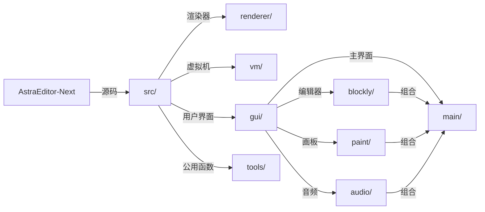

# AstraEditor-Next

> [!WARNING]
> 此项目仍为计划，具体动工时间未定。 

### [AstraEditor](https://github.com/AstraEditor)

## 介绍

`AstraEditor-Next` 是 `AstraEditor` 的 **重制版本**，它不再基于任何 `Scratch` 改版。

值得一提的是，`AstraEditor-Next` 可以兼容 `Scratch 3.0` 项目文件（`.sb3`），这意味着你可以在任何`Scratch`及其修改版平台上**无损运行**。

## 项目架构

`AstraEditor-Next` 基于 `React` + `Vite` 技术栈。

`AstraEditor-Next` 的项目结构如下:

> [!NOTE]
> 未来可能仍会变动。

